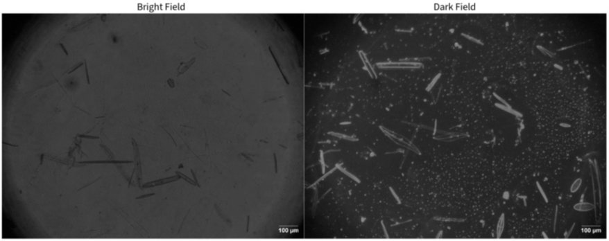
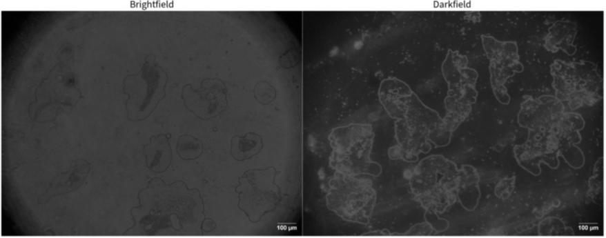
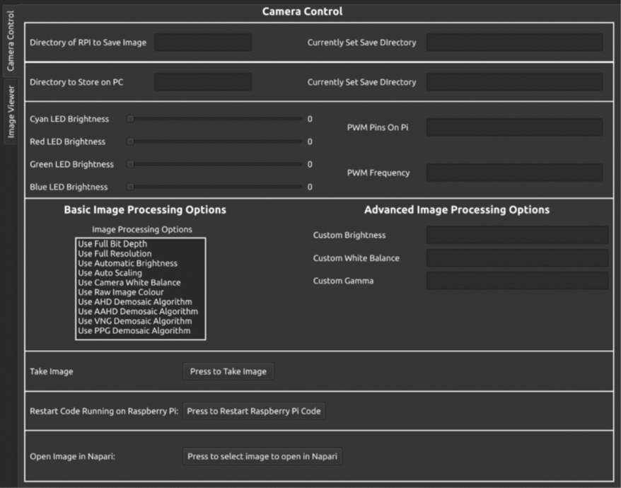

# Compact-high-efficiency-illumination-systems-for-in-orbit-microscopy
Presents all data associated with the development of my thesis for a 3rd year final year project at the University of Nottingham
***
## Project Overview
The aim of the project was to develop a solution to image specimens such as C. elegans and similar sized organisms in bright field and darkfield modalities, that would fit in a 1U Cube Sat (10cm^3).

***
## Project Evaluation
The project overall was a success as the system was able to take both bright field and dark field images with high enough resolution and resolving power to accurate image Diatoms, C.elegans and Buccal Epithelial Cells, however the code was not developed to run autonomously but the code developed for the Raspberry Pi as part of the GUI control could be quickly and easily modified to make a autonomous system due directly relevent code wrote in a generic way such that it can be reused.

Due to cost restraint a set of cheap lenses were used, but the datasheet that came with these lenses had all incorrect parameters such as FOV or MOD. For this reason significant time was spent characterising the lenses so the data could be relied upon.

For full evaluation of the design and the data my thesis can be found in the thesis directory.

### Images Taken on the Microscope
***
#### Diatoms Bright and Dark Field

#### Buccal Epithelial Cells Bright and Dark Field

***

### CAD Images of the Microscope System
***

***

## Control Interface
For ease of testing / taking images with the microscope a GUI was developed in C++ using QT to control all aspects of the microscope remotely when connected on the same network. This allowed for control of:
- Automatic transfer of the images taken on the Raspberry Pi to the host PC
- Save directory locations for both the Raspberry Pi side and the host PC side for saving the recieved images from the Raspberry Pi
- Brightness and PWM frequency controll of all 3 colour rings plus the central cyan LED used for rhinefield illumination
- Multiple basic (binary) image processing options such as the type of demosaic algorithm, and others
- Advanced image processing options such as custom brightness, white balance and gamma options
- Finally a button to allow the user to take an image once parameters have been set by the user

## Future Work / Improvements
If this project was to be taken forward, the current PCB's would work but really require a PCB assembly house to manufacture and populate the board as it is too densely packed with too small component to do by hand and was a main struggle in the project.

That said an improved design for the illumination board has already been created and tested based on addressable SK6805 LEDs and will be uploaded to this github repo in the future once the driver board for it has been finalised and tested.
The new design will be able to be controlled via a plug-in for the open source microscopy software micro-manager, it will provide a GUI that will allow the user to control the illumination system from the host PC running micro-manager, as micro-manager
was wrote in java it is inherently cross platform and thus the plug-in should work for any OS.

Also as potential future upgrades would be to add a form of auto focus as although the microscope worked and gathered detailed images it was hard to get the specimens in focus.
***

